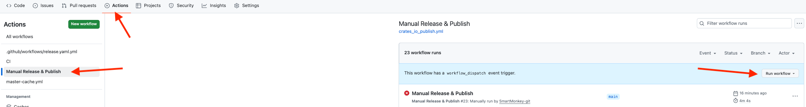

# Robinson Group Rust Template [![License: MIT][license-badge]][license]

[license]: https://opensource.org/licenses/MIT

[license-badge]: https://img.shields.io/badge/License-MIT-blue.svg

This repo serves as a template for rust projects in the [Robinson Group](https://robinsongroup.github.io/) of the BIH.

## How to use this template

To the top right-hand side of this repository, you will find a button
labeled $${\color{green}Use \space this \space Template}$$. Press it and then click on ``Create a new repository``. This
will copy the contents of the repository to your account.

## CI

The CI uses nexttest, rustfmt and clippy to test, format and lint your code.

## Releases to Crates IO

The Template features a Github Action to publish to crates.io.
To use this

1. Create a Github token at https://github.com/settings/tokens
2. Then store the token as `PERSONLA_TOKEN` in
   your [repository secrets](https://docs.github.com/de/actions/how-tos/write-workflows/choose-what-workflows-do/use-secrets).
3. Go to crates.io, create an account, if you haven't already, and create a API Token.
4. Add that token also to your repository secrets as `CARGO_REGISTRY_TOKEN`

You can run the release pipeline manually in the actions tab:

The action will publish to crates.io, create a github release and open a PR to bump to your new version.

## Educational Material

- [The Rust Book](https://doc.rust-lang.org/book/) and [The Cargo Book](https://doc.rust-lang.org/cargo/index.html).
- [Rustlings](https://rustlings.rust-lang.org/)

## License

This project is licensed under MIT.
